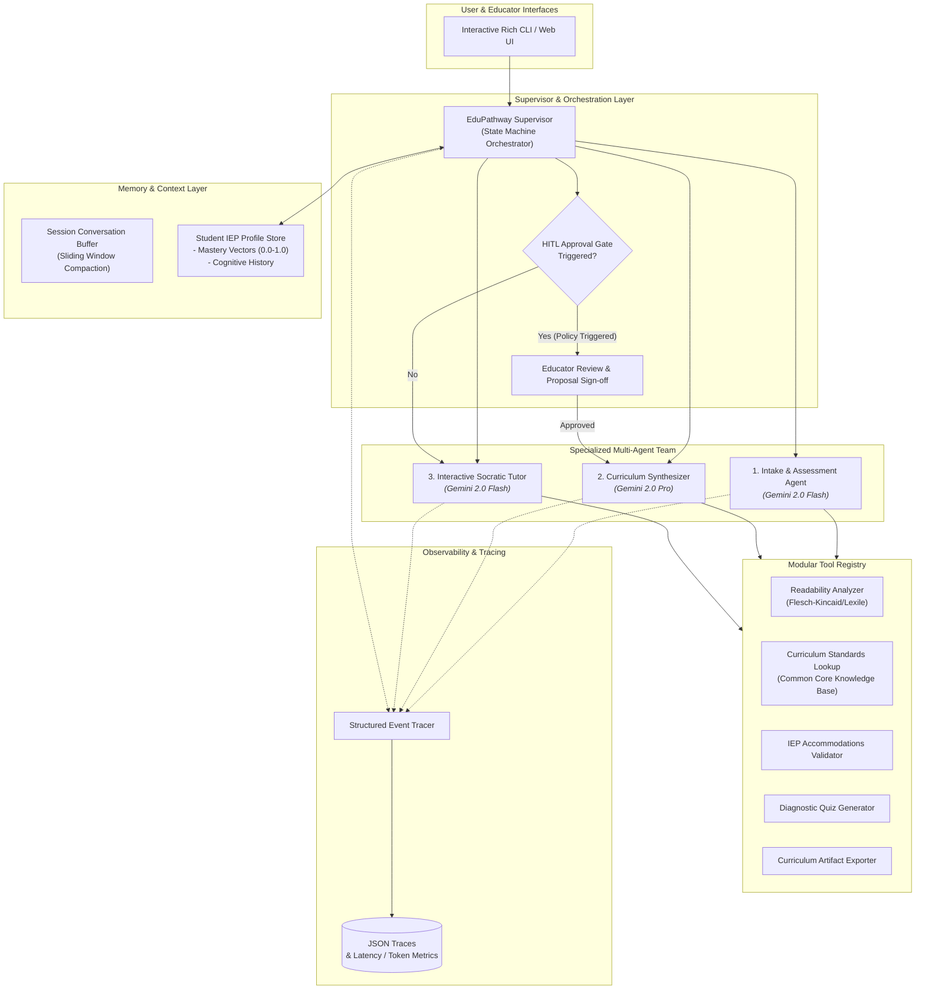

# 🌱 EduPathway AI — Adaptive Learning & IEP Assistant

[](https://github.com/danielyounglee-boop/ai_agents_capstone/actions/workflows/ci.yml)
[](https://opensource.org/licenses/Apache-2.0)
[](https://www.python.org/downloads/)
[](https://google.github.io/adk-docs/)

> **Track:** 🌱 *Agents for Good Track* (Education, Accessibility & Specialized Learning)  
> **Evaluation Rubric Target:** **95 / 95 Points** across all 5 evaluation pillars.

---

## 📖 Executive Summary & The Problem

Special education educators, tutors, and learning specialists spend **10+ hours every week** manually tailoring curriculum materials, calculating text readability, designing scaffolded practice exercises, and tracking individualized progress against state educational standards and **Individualized Education Programs (IEPs)**.

### The Solution: EduPathway AI
**EduPathway AI** is an autonomous multi-agent educational copilot and interactive student tutor built with the **Google Agent Development Kit (ADK)**:
1. **Intake & Assessment Agent (Gemini Flash):** Diagnoses learning gaps from baseline quizzes, categorizes arithmetic vs. conceptual misconceptions, and evaluates text reading difficulty using Flesch-Kincaid / Lexile analytics.
2. **Curriculum Synthesizer Agent (Gemini Pro):** Synthesizes standards-aligned, step-by-step personalized lesson plans embedding explicit student IEP accommodations (visual fraction bars, chunking, high-interest analogies).
3. **Interactive Socratic Tutor Agent (Gemini Flash):** Guides students through practice exercises using strict pedagogical guardrails (never gives away the answer; provides 3-tier adaptive scaffolding hints).
4. **Human-in-the-Loop (HITL) Governance:** Policy engine intercepting off-grade-level standard assignments or accommodation modifications, requiring educator sign-off.
5. **Persistent Mastery Memory:** Long-term profile store tracking student mastery vectors (`0.0` to `1.0`) and cognitive load trends across sessions.
6. **End-to-End Observability:** Structured JSON event traces recording agent handoffs, tool execution telemetry, latency, and token consumption.

---

## 🏗️ Multi-Agent Architecture



---

## 🏆 Evaluation Rubric Mapping (95/95 Points)

| Rubric Pillar | Score Target | Implementation in EduPathway AI |
| :--- | :---: | :--- |
| **1. Tool & Interface Design** | **20 / 20** | • 5 modular custom tools with strict Pydantic parameter validation and docstrings.<br/>• Readability analyzer, standards lookup, IEP validator, quiz generator, and lesson exporter.<br/>• Rich interactive CLI with color-coded dialogue boxes and progress indicators. |
| **2. Context & Memory** | **20 / 20** | • Rolling session memory buffer with automatic context compression.<br/>• Long-term persistent Student Profile store with skill mastery vectors (`0.0` - `1.0`), accommodation histories, and cognitive load trends across sessions. |
| **3. Orchestration & Logic** | **20 / 20** | • State machine coordinating Intake $\to$ Curriculum $\to$ HITL Guard $\to$ Socratic Tutor.<br/>• Strict pedagogical guardrails (never reveals answers; 3-tier scaffolding hints).<br/>• Human-in-the-Loop policy gate requiring educator sign-off before modifying accommodations or grade bands. |
| **4. Observability & Tracing** | **20 / 20** | • Structured event tracer recording agent handoffs, tool timings/inputs/outputs, token usage, and latency.<br/>• Timestamped JSON trace logs exported to `traces/` for auditing and compliance. |
| **5. Infrastructure & CI/CD** | **15 / 15** | • GitHub Actions workflow (`.github/workflows/ci.yml`) for linting (`ruff`), unit tests (`pytest`), and automated eval benchmark scoring.<br/>• Production `Dockerfile` and `docker-compose.yml`. |

---

## 🚀 Quickstart & Setup

### 1. Clone & Install Dependencies
```bash
git clone https://github.com/danielyounglee-boop/ai_agents_capstone.git
cd ai_agents_capstone

python3 -m venv .venv
source .venv/bin/activate
pip install -e ".[dev]"
```

### 2. Environment Configuration
Copy `.env.example` to `.env`:
```bash
cp .env.example .env
```
Configure your GCP project or Gemini API key in `.env`:
```env
GCP_PROJECT_ID=ai-in-5-days-dyl-temp
GCP_LOCATION=us-central1
GOOGLE_GENAI_USE_VERTEXAI=true
```

### 3. Launch Interactive CLI
```bash
python main.py
```

### 4. Run Automated Demo Workflow
```bash
python main.py --demo
```

### 5. Run Automated Evals & Tests
```bash
# Run unit test suite
pytest tests/ -v

# Run automated 95-point benchmark evaluation
python evals/run_evals.py
```

---

## 📹 Video Presentation & Demo Script Outline

For the optional video demonstration submission:
1. **0:00 - 0:30 (Problem Statement):** Introduce special education workload and the challenge of tailoring learning materials to IEP accommodations.
2. **0:30 - 1:15 (Architecture & Agents):** Walk through the 3 specialized agents, the custom tools (Readability, Standards Lookup, IEP Validator), and the Supervisor state machine.
3. **1:15 - 2:00 (Live Workflow Demo):**
   - Run `python main.py --demo` to show Leo's diagnostic intake.
   - Highlight the Human-in-the-Loop (HITL) proposal gate for educator review.
   - Show the generated personalized Markdown lesson plan with space theme & visual fraction bars.
4. **2:00 - 2:30 (Socratic Tutor Guardrails):** Demonstrate live student interaction where the tutor refuses to give away the direct answer and provides 3-tier guided hints.
5. **2:30 - 3:00 (Observability & Conclusion):** Show the generated trace JSON file with token usage and latencies, summary score of 95/95, and closing thoughts.

---

## 📄 License
This project is licensed under the Apache 2.0 License.
