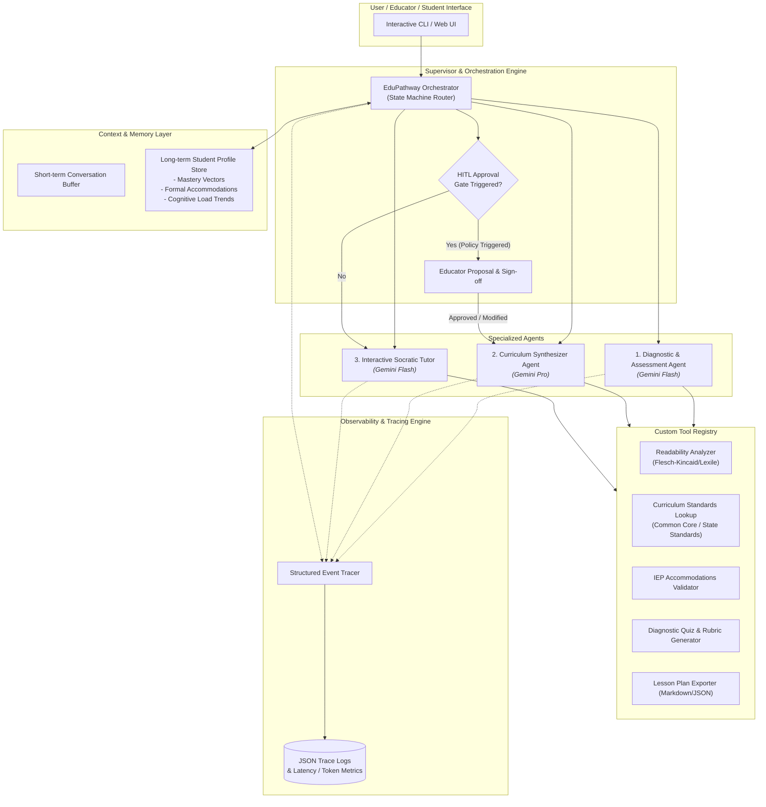

# EduPathway AI — Architecture & Technical Specification

> **Track:** 🌱 Agents for Good  
> **Target:** Special Education, IEP Customization, & Adaptive Learning  
> **Evaluation Alignment:** 95/95 Max Target across Tool Design, Context & Memory, Orchestration, Observability, and CI/CD.

---

## 1. Problem & Executive Summary

### The Problem
Special education educators, tutors, and learning specialists spend **10+ hours per week** manually tailoring curriculum materials, calculating readability levels, designing scaffolded practice problems, and tracking individualized progress against state educational standards and **Individualized Education Programs (IEPs)**.

### The Solution: EduPathway AI
**EduPathway AI** is an autonomous multi-agent educational copilot and student tutor designed to:
1. **Assess & Diagnose:** Parse student work/quiz diagnostics, measure reading grade levels (Flesch-Kincaid / Lexile approximation), and detect foundational skill gaps.
2. **Synthesize Custom IEP-Aligned Curricula:** Generate structured, scaffolded lesson plans with custom accommodations (e.g., visual scaffolding, sensory breaks, chunked questions, high-interest analogies).
3. **Engage with Socratic Tutoring:** Act as an interactive, pedagogical student tutor with strict guardrails (guided questioning without directly giving away answers).
4. **Enforce Human-in-the-Loop (HITL) Governance:** Intercept critical decisions (e.g., changing grade bands, modifying formal IEP accommodations) and generate actionable educator approval proposals.
5. **Persist Long-Term Mastery Memory:** Track student mastery vectors, skill trajectories, and cognitive fatigue trends across multiple sessions.
6. **Provide End-to-End Observability:** Emit structured trace logs containing agent handoffs, tool execution telemetry, token usage, and latency.

---

## 2. System Architecture & Multi-Agent Topology



---

## 3. The Multi-Agent Team

### 1. Intake & Assessment Agent
- **Model:** `gemini-2.0-flash` (or configurable model alias)
- **Role:** Analyzes raw student diagnostic assessments, baseline quizzes, or open-ended responses.
- **Responsibilities:**
  - Extracts conceptual errors vs. calculation errors.
  - Computes text readability / reading level mismatch using the Readability tool.
  - Determines cognitive load and frustration cues.
  - Outputs a standardized `AssessmentReport` schema.

### 2. Curriculum Synthesizer Agent
- **Model:** `gemini-2.0-pro` / `gemini-2.0-flash`
- **Role:** Builds tailored, scaffolded lesson plans and practice materials.
- **Responsibilities:**
  - Ingests the student's `AssessmentReport` and long-term `IEPProfile`.
  - Consults the `Curriculum Standards Lookup` tool for benchmark alignments.
  - Embeds explicit accommodations (e.g., chunking, visual guides, simplified vocabulary, high-interest themes).
  - Formats output into structured `LessonPlan` and `PracticeProblemSet` objects.

### 3. Interactive Socratic Tutor Agent
- **Model:** `gemini-2.0-flash`
- **Role:** Real-time conversational tutor for the student.
- **Pedagogical Guardrails:**
  - **Never give the direct answer:** Prompts the student with reflective questions and hints.
  - **Scaffolded hints:** Tier 1 (conceptual hint) $\to$ Tier 2 (process hint) $\to$ Tier 3 (worked sub-step).
  - **Encouragement & tone modulation:** Warm, positive reinforcement adapted to student frustration level.
  - Updates mastery status dynamically as student demonstrates comprehension.

### 4. Supervisor & HITL Policy Manager
- **Role:** Controls state transitions and guards safety/accommodations integrity.
- **HITL Policy Triggers:**
  - Advancing or lowering a grade band target.
  - Modifying official IEP accommodations (e.g., changing time extensions or sensory accommodations).
  - High frustration / cognitive overload alarm.
  - Outputs an `EducatorProposal` requiring explicit confirmation `[Approve / Reject / Edit]`.

---

## 4. Evaluation Rubric Breakdown (95 Point Plan)

### Pillar 1: Tool & Interface Design (20 Points)
- **Typed Pydantic Schemas:** Every tool parameter and return type strictly validated with `pydantic`.
- **Modular Tools:**
  1. `calculate_readability(text: str)`: Returns Flesch Reading Ease, Flesch-Kincaid Grade Level, and estimated Lexile.
  2. `lookup_standards(grade: int, subject: str, topic: str)`: Searches curriculum learning standards and prerequisite trees.
  3. `validate_accommodations(lesson_content: str, student_accommodations: List[str])`: Verifies that required IEP modifications are present.
  4. `generate_diagnostic_quiz(subject: str, topic: str, difficulty: str, num_questions: int)`: Creates calibrated diagnostic questions with rubrics.
  5. `export_curriculum(lesson_plan: dict, export_format: str)`: Generates clean Markdown/JSON artifacts.
- **Interfaces:** Rich interactive CLI (with colored output, progress spinners, markdown rendering) and programmatic API.

### Pillar 2: Context & Memory (20 Points)
- **Short-Term Memory:** Rolling window conversation buffer with semantic summary rollups to prevent context overflow.
- **Long-Term Memory (Student Profile Store):**
  - Persistent JSON/SQLite/Firestore-ready store.
  - Tracks:
    - Mastery Vectors (`{"fractions_addition": 0.85, "fractions_multiplication": 0.35}`)
    - Historical session logs and timestamped progress.
    - IEP accommodations and preferred learning modalities.
    - Cognitive fatigue / attention indicators.

### Pillar 3: Orchestration & Logic (20 Points)
- State-machine driven workflow with clear routing:
  $$\text{Intake Diagnostic} \longrightarrow \text{Gap Analysis} \longrightarrow \text{Curriculum Synthesis} \overset{\text{HITL Gate}}{\longrightarrow} \text{Socratic Tutoring}$$
- Explicit fallback routes for malformed outputs or tool errors.
- Clean separation between student-facing mode and educator/admin mode.

### Pillar 4: Observability & Tracing (20 Points)
- **Centralized Event Tracer:** Records structured trace events:
  - `AGENT_START` / `AGENT_END` (with latency and token usage)
  - `TOOL_CALL_START` / `TOOL_CALL_END` (with inputs, outputs, execution time, error status)
  - `HITL_TRIGGER` / `HITL_RESOLVE`
  - `STATE_TRANSITION`
- **Trace Exporter:** Automatically writes timestamped JSON trace files to `traces/trace_<session_id>.json`.
- Visual trace summary printed at the conclusion of a session.

### Pillar 5: Infrastructure & CI/CD (15 Points)
- **CI Pipeline (`.github/workflows/ci.yml`):**
  - Linting (`ruff check`)
  - Code formatting (`ruff format --check`)
  - Unit tests (`pytest tests/`)
  - Automated Eval validation (`python evals/run_evals.py`)
- **Docker Packaging:** Production-ready `Dockerfile` and `docker-compose.yml`.
- **Environment & Secret Hygiene:** `.env.example` with zero credential leakage.

---

## 5. Repository File Structure

```text
ai_agents_capstone/
├── .github/
│   └── workflows/
│       └── ci.yml               # Automated linting, testing, and eval checks
├── planning/
│   ├── ARCHITECTURE.md          # Complete architectural specification (this file)
│   └── ROADMAP.md               # Step-by-step implementation milestones
├── src/
│   └── ai_agents_capstone/
│       ├── __init__.py
│       ├── config.py            # Environment, model settings, constants
│       ├── models/              # Pydantic data schemas
│       │   ├── __init__.py
│       │   ├── assessment.py    # Diagnostic reports, quiz submissions
│       │   ├── curriculum.py    # Lesson plans, standards, accommodations
│       │   ├── profile.py       # Student IEP profile, mastery vectors
│       │   └── trace.py         # Telemetry and event log schemas
│       ├── tools/               # Modular tool registry
│       │   ├── __init__.py
│       │   ├── readability.py   # Text readability & Lexile analyzer
│       │   ├── standards.py     # Educational standards database/lookup
│       │   ├── accommodations.py# IEP compliance validator
│       │   └── assessment_tool.py# Diagnostic quiz generator
│       ├── memory/              # Memory & persistence layer
│       │   ├── __init__.py
│       │   ├── session_memory.py# Short-term buffer & summarizer
│       │   └── profile_store.py # Long-term student profile persistence
│       ├── agents/              # Specialized agents
│       │   ├── __init__.py
│       │   ├── base.py          # Base agent abstract class
│       │   ├── intake_agent.py  # Diagnostic & Assessment Agent
│       │   ├── curriculum_agent.py # Curriculum Synthesizer Agent
│       │   └── tutor_agent.py   # Socratic Interactive Tutor Agent
│       ├── orchestration/       # Multi-agent coordination & HITL
│       │   ├── __init__.py
│       │   ├── supervisor.py    # State machine supervisor
│       │   └── hitl.py          # Human-in-the-Loop policy gate
│       ├── observability/       # Telemetry, logging & traces
│       │   ├── __init__.py
│       │   └── tracer.py        # Structured JSON trace collector
│       └── ui/                  # User interfaces
│           ├── __init__.py
│           └── cli.py           # Rich CLI application
├── evals/                       # Automated evaluation benchmark
│   ├── eval_datasets.json       # Benchmark student profiles & test cases
│   └── run_evals.py             # LLM-as-a-judge scoring script
├── tests/                       # Unit & integration test suite
│   ├── test_tools.py
│   ├── test_memory.py
│   ├── test_agents.py
│   ├── test_orchestration.py
│   └── test_observability.py
├── data/                        # Sample profiles & standards data
│   ├── sample_students.json
│   └── educational_standards.json
├── .env.example
├── .gitignore
├── Dockerfile
├── main.py                      # Main entrypoint
├── pyproject.toml
└── README.md
```
